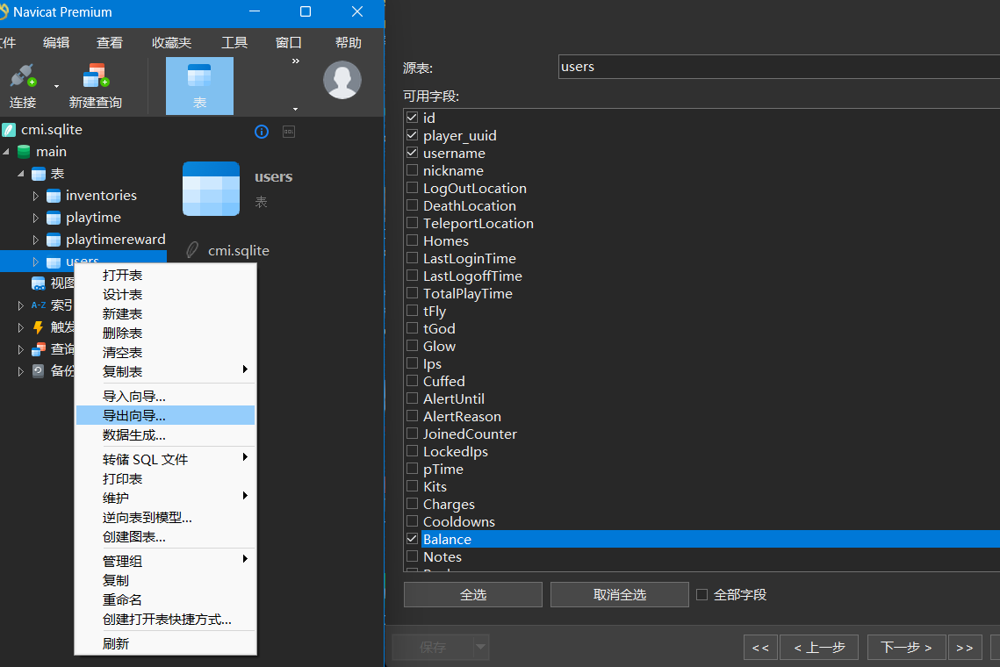

# 将CMI经济迁移到Essentials

### 快速开始

- 打开CMI数据库（例如：cmi.sqlite.db）
- 导出users表给xlsx文件且只选择`id`，`*player_uuid`，`username`，`*Balance`这四项（[见示例](users.xlsx)）
- 将导出的`users.xlsx`与`main.py`同目录放置
- 运行`python main.py`，片刻后将在同目录下生成适用于Essentials插件的userdata文件，复制到配置文件内即可完成迁移

如上图所示，使用软件为[Navicat Premium 16](https://www.navicat.com/en/download/navicat-premium)